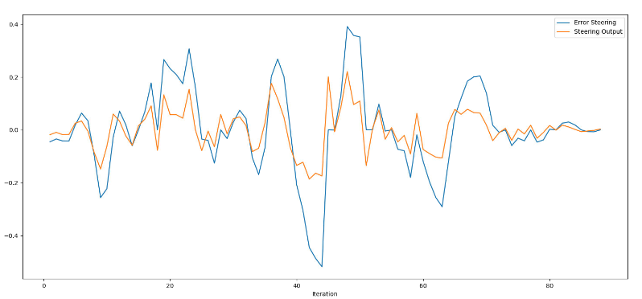
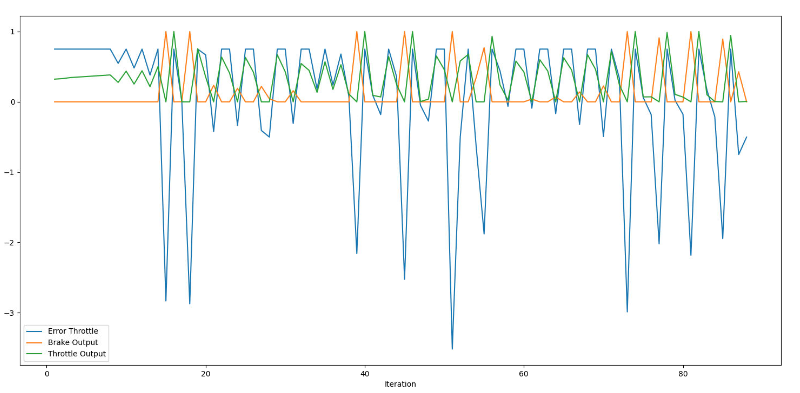

# Repository Description: PID Controller Library

This repository contains a C++ implementation of a PID (Proportional-Integral-Derivative) controller. The PID controller is a widely used feedback control mechanism in engineering, particularly in control systems, robotics, and automation. The library provides a flexible and customizable PID controller that can be integrated into various projects requiring closed-loop control.

## Files:
1. **pid_controller.cpp**: Header file defining the PID class and its member functions and variables. It contains the class declaration for the PID controller along with the necessary member variables and methods.

2. **pid_controller.h**: Source file implementing the methods defined in the `pid_controller.h` header file. It contains the definitions for the PID class member functions, including initialization, error update, total error calculation, and delta time update.

## Usage:
- To use the PID controller library in your project, include the `pid_controller.h` header file in your source code.
- Create an instance of the PID class and initialize it with the desired PID gains (Kp, Ki, Kd) and output limits.
- Call the `UpdateError` method with the current error value to update the controller's internal state.
- Call the `TotalError` method to compute the control output based on the current error and controller gains.
- Optionally, update the delta time using the `UpdateDeltaTime` method if the time step changes during runtime.

## Example:
```cpp
#include "pid_controller.h"
#include <iostream>

int main() {
    PID pid_controller;
    pid_controller.Init(0.1, 0.01, 0.5, 100, -100);
    double current_error = 5.0;
    pid_controller.UpdateError(current_error);
    double control_output = pid_controller.TotalError();
    std::cout << "Control Output: " << control_output << std::endl;
    return 0;
}

```

## Result
### Plot 1 


### Plot 2


